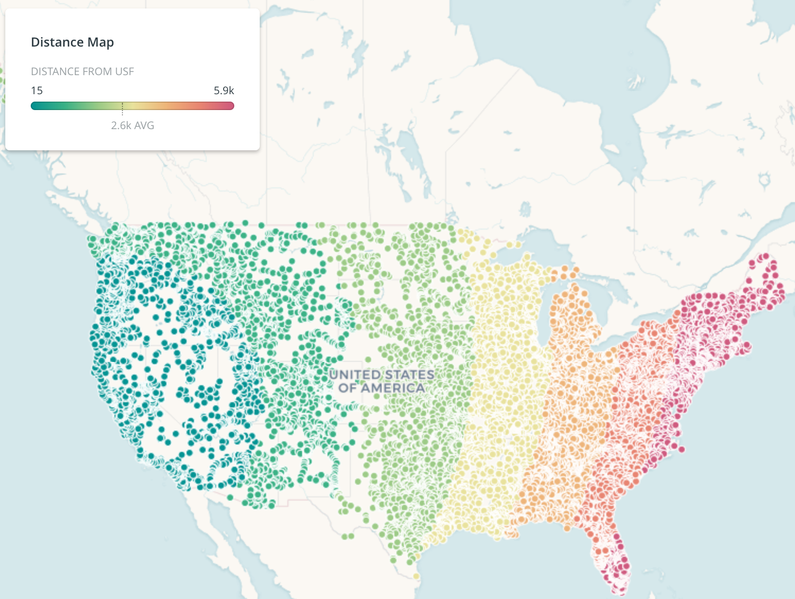

[Lecture slides](https://docs.google.com/presentation/d/1-YvZtlRoEGE832ZhSwgchScLp0WuLXFxUcpfZfZvnEE/edit#slide=id.p)

The objective of this tutorial is to learn the basics of SQL (structured query language) through the Carto editor.  Carto is built on a database called PostgreSQL.  SQL is the languaged used to interact with the database, which is particularly well-suited for GIS because it is a *relational* database. 

A relational database stores tabular data (rows and columns) with links or relations easily accessible.  This way, data can be accessed and reassembled without having to reorganize the stored tables.  There is a special database extender for PostgreSQL called PostGIS that makes it easier to make GIS-based queries to the vanilla relational database. 

For example, the concept of *closeness* is a location-based relational query.  PostGIS adds support for geographic objects to allow for location queries.  PostGIS allows you to perform geospatial queries such as finding all data points that are within a given radius, the area of polygons in your table, and much more.

**The Carto editor simplifies the process of making web-based SQL queries to a PostgreSQL relational database, with the spatial database extender, PostGIS.**

We will be working with the [USGS stream guage data](http://waterdata.usgs.gov/nwis/rt) in today's tutorial.  

From the Carto data set dashboard, connect the `realstx` dataset, *Realtime US streamflow stations*, which contains streamflow information of over 4,000 stream gage stations.  Click **New dataset**, then use the URL for `realstx_shp.tgz` [on this page](https://water.usgs.gov/GIS/metadata/usgswrd/XML/realstx.xml#stdorder). Set up daily syncing.

### SQL basics

Carto has another copy of this data set that we can query using URLs. Here's a sample query:

[`https://common-data.carto.com/api/v2/sql?q=select+*+from+realstx+limit+10`](https://common-data.carto.com/api/v2/sql?q=select+*+from+realstx+limit+10)

Examine this URL and the embedded SQL query. Copy and paste it into a new browser tab.

* What happens? How many records are there? Can you change a parameter in the URL and get different results? Add `&format=shp` to the end of the URL. What happens?

Visit the [USGS page](http://waterdata.usgs.gov/nwis/rt) to get a sense of the variable meanings.  Specifically, what is a [percentile](http://help.waterdata.usgs.gov/faq/surface-water/what-is-a-percentile?searchterm=percentile)?  What is gage height, also known as [stage](http://help.waterdata.usgs.gov/faq/surface-water/how-to-interpret-gage-height-and-streamflow-values)?

View just a few columns from the table.  You can toggle between the `Metadata` and `SQL` view at the bottom of the dataset screen.

* What is the default query?  What is shown with the default query?  

Rewrite the query to sort the table by the column `flow` (which is the volume of water flowing past the station in ft^3/second). Find the river with the highest flow by looking at `staname`.

* What is the largest flow value?

```sql
SELECT staname, flow
FROM realstx
ORDER BY flow DESC
```

Then order the table by date, with the oldest rows first.

```sql
SELECT time
FROM realstx
ORDER BY time ASC
```

This is supposed to be a realtime data set.

* Can we trust this data? What could we do to make sure our future map represents reality effectively?

The `CURRENT_DATE` function returns the current date, which we can use to find the date from two days ago. This way, our future map will always be up to date instead of hardcoded with whatever day we are doing this in class. Test it out:

```sql
SELECT (CURRENT_DATE - integer '2') AS recent
```

* What do you think `AS recent` does? Why might this be useful?

Now count the number of records in that time period. 

```sql
SELECT COUNT(*) AS recent_count
FROM realstx_copy
WHERE time::date >= (CURRENT_DATE - integer '2')
```

* What do you think `::date` in the query above means? How many records are there total?

Select only records from the last two days.

```sql
SELECT *
FROM realstx_copy
WHERE time::date >= (CURRENT_DATE - integer '2')
```

Let's explore the `flow` column a bit more.

* What is the `average` `flow`? What are the `min`/`max`?

```SELECT MIN(flow) AS min, MAX(flow) AS max, AVG(flow) AS avg
FROM realstx_copy
```

* What is the median flow value? What is the significance of this?

```sql
SELECT PERCENTILE_CONT(0.5) WITHIN GROUP (ORDER BY flow) AS median
FROM realstx_copy
```

Look at the watershed variable `huc`, which stands for `hydrologic unit code`.

- How many watersheds are represented in the data? How many stations are there in the watershed `01010001`?

```sql
SELECT COUNT(DISTINCT huc)
FROM realstx_copy
```

```sql
SELECT COUNT(staid)
FROM realstx_copy
WHERE huc = '01010001'
```

Find out more about this watershed by using the USGS link. Note the watershed id (`huc`) in the URL: [`http://water.usgs.gov/lookup/getwatershed?01010001`](http://water.usgs.gov/lookup/getwatershed?01010001).

Select only the stations in this watershed.

```sql
SELECT *
FROM realstx_copy
WHERE huc = '01010001'
```

* Where are these stations? How many are there? (Hint: use the `Preview` button)

### GROUP BY
A common operation in data science is to collapse tabular data into group averages, counts, minimums, maximums, and other reduction operations. What is the largest earthquake by country? How many airports are in each state? We group these events by a shared attribute, whether text (e.g. country name) or geographic entities (e.g. country boundary).

Let's do an GROUP BY aggregation to see which watershed has the most stations.


```sql
SELECT huc, count(*)
FROM realstx_copy
GROUP BY huc
ORDER BY count DESC
```

Preview a map of the ten measurements with the highest gage height.

```sql
SELECT *
FROM realstx_copy
ORDER BY gage DESC
LIMIT 10
```

* Which state contains the measurement with the *largest* gage height? How high is it?

```sql
SELECT st, stage
FROM realstx_copy
ORDER BY stage DESC
LIMIT 10
```

Select all stations that contain the word `brook` in the column (`staname`).  (Hint: look into [pattern matching](https://www.postgresql.org/docs/7.3/static/functions-matching.html).)

```sql
SELECT *
FROM realstx_copy
WHERE staname ILIKE '%brook%'
```

* What happens when you only select `staname` and attempt to preview the map?

```sql
SELECT staname
FROM realstx_copy
WHERE staname ILIKE '%brook%'
```

### the_geom

Now that we have a handle on some basic SQL, we will shift our focus to two special columns in Carto. The first is `the_geom`, which is where some of your geospatial data is stored.  The second is `the_geom_webmercator` which contains all the same points that were in `the_geom`, but projected to Web Mercator, a web-optimized version of the historical Mercator projection. `the_geom_webmercator` is required by Carto to display information on your map. It is normally hidden from view because Carto updates it in the background so you can work purely in WGS84 (latitude and longitude).  

Let's try to figure out what `the_geom_webmercator` looks like.  Use the `ST_AsText()` command and note that, strangely, the column `the_geom_webmercator` exists even though you can't see it when you examine the table.

```sql
SELECT cartodb_id,
       ST_AsText(the_geom_webmercator) AS webmercator, 
       ST_AsText(the_geom) AS latlons
FROM realstx_copy
```

As you can see, the values are pretty huge - not -180 to 180 or -90 to 90 (as you'd expect with lat/lon). Valid values are actually as large as +/-20 million because the circumference of the earth is around 40 million meters.

This projection takes the furthest North and South to be ± 85.0511°, which allows the earth to be projected as a large square, very convenient for using square tiles with on the web. It excludes the poles, so other projections will have to be used if your data requires them. 

Also note a new type of object appearing in the SQL statement above: `ST_AsText()`. This is a PostGIS function that takes a geometry and returns it in a more readable form.

There are many variants to the common projections, so groups of scientists and engineers got together to create unambiguous designations for projections known as [SRID](https://en.wikipedia.org/wiki/SRID). The two of interest to us are:

- 4326 for [WGS84](https://en.wikipedia.org/wiki/World_Geodetic_System), which defines `the_geom`;
- 3857 for [Web Mercator](https://en.wikipedia.org/wiki/Web_Mercator), which defines `the_geom_webmercator`.

PostGIS will return measurement in the same units as the input projection. Suppose you want to measure the distance between two points stored in `the_geom` that we can call `the_geom_a` and `the_geom_b`. If you input them both into `ST_Distance(the_geom_a, the_geom_b)` the result would come back in units of WGS84. This is not very useful because the answer is in degrees. Instead, we want to measure distance in meters (or kilometers).

You can measure distances (and make many other measurements in PostGIS) using meter units if you run the measurements with data on a globe. So we need to project `the_geom` and our point to PostGIS geography type. We can do this by appending `::geography` to both of them in the function call, as below. Notice that we need to divide the value returned by `ST_Distance()` by 1000 to go from meters to kilometers.

Let's calculate distance to USF for each row in the table. We'll use the original data set - not the copy - so that we retain the daily updates.

```sql
SELECT
  *,
  ST_Distance(
    the_geom::geography, 
    CDB_LatLng(37.7833,-122.4167)
  ) / 1000 AS dist
FROM realstx
```

## Distance map

Let's make a map from this view of the table. With the last query still active, select `Create Map`. This creates a new map based on the result of that query. Because we included `*` in the `SELECT` statement, the special column `the_geom_webmercator` is being used to create the map.

*As mentioned above, this map remains connected to the original data set, which is updated daily. The SQL view with `dist` is calculated on the fly as you browse the map.*

Once you have your map, set the style for the points. Choose a color scheme using the `by value` option for the `dist` column. Add a legend based on the `dist` column.

[](https://robin-test.carto.com/builder/f8e77e1b-d24e-4ec4-a4b9-fbef59098393/embed)

## Assignment

1. Create a map of earthquakes over the past 30 days, using the [USGS earthquake data](http://earthquake.usgs.gov/earthquakes/feed/v1.0/csv.php).  Note that the objective is to communicate the spatial information, so think carefully about the design.

    - Size the earthquake points according to magnitude, and color them based on distance from USF's campus `{latitude: 37.7833, 'longitude': -122.4167}`.
    - Style the info pop-up. Add information to the pop-up that you think would be useful to a user.
    - Publish the map and post the URL to Canvas. Make sure it's publicly available.

2. Where were the five closest earthquakes to USF in the past 30 days? Submit the SQL query and a screenshot of the map preview.

3. Write a product brief for your final project. In a nutshell, you should be able to fill in this sentence (replacing `product` with `map`):

[](https://medium.com/@jaf_designer/why-product-thinking-is-the-next-big-thing-in-ux-design-ee7de959f3fe)

Include answers to the following questions:

* What do you want your map to be about?  
* What kinds of data could help you make this map?  
* Have you found the data sets you need? What are they?  
* Who is your audience?  
* What do you want your audience to learn? What story are you trying to tell?  
* What kinds of SQL queries - spatial or regular - might you need to make your map?  