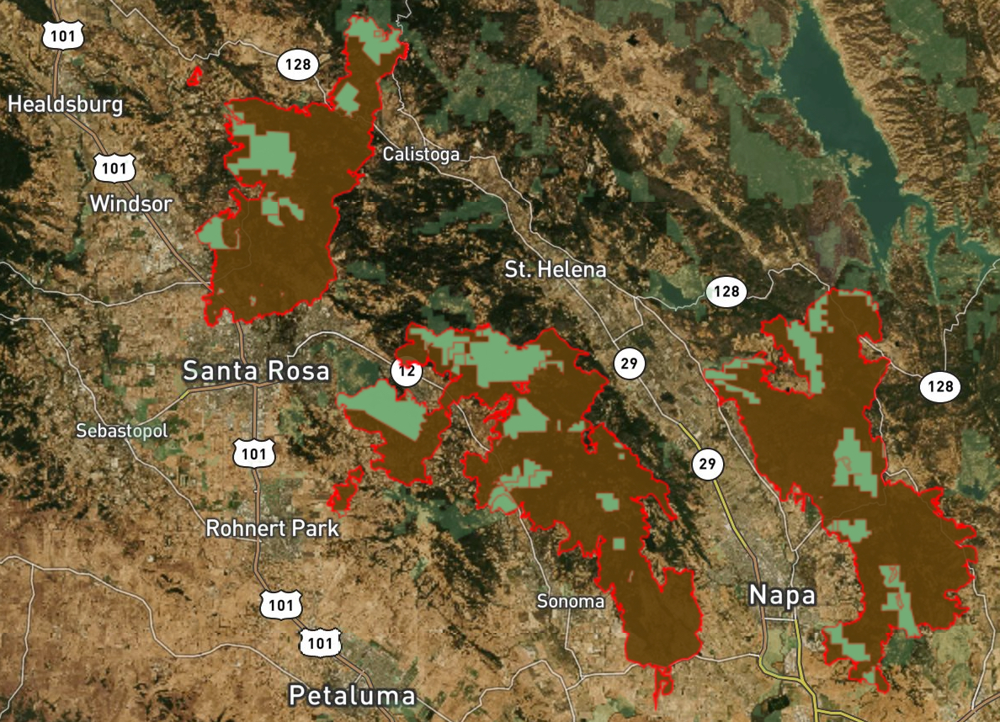

Today we are going to [recreate this map](https://robinkraft.carto.com/builder/3f1f3afa-ab5b-4cb3-83d3-d7d6272cc894/embed), which shows California parks that burned during the fires up in Sonoma County.



This will be interesting because it requires a complex SQL query, custom styling with CartoCSS, a custom basemap, and different data visible at different zoom levels.

But first, some background.

## Spatial queries
PostGIS supports [an extensive set](https://postgis.net/docs/manual-2.4/reference.html#Spatial_Relationships_Measurements) of queries around spatial relationships and processing. For example:

* [ST_Intersects](http://postgis.org/docs/ST_Intersects.html) (true/false
* [ST_Intersection](http://postgis.org/docs/ST_Intersection.html) (returns the intersection geometry)
* [ST_Within](http://postgis.org/docs/ST_Within.html) (true/false)
* [ST_Length](http://postgis.org/docs/ST_Length.html) (returns length in degrees or meters)
* [ST_Area](http://postgis.org/docs/ST_Area.html) (returns area in square degrees or meters)
* [ST_Touches](http://postgis.org/docs/ST_Touches.html) (true/false)
* [ST_Union](http://postgis.org/docs/ST_Union.html) - merge geometries

Let's use some of these to work with the flow data from last week, state boundaries, and lake boundaries.

##### Data sets
* Get the URL for [Natural Earth 110m provinces](http://www.naturalearthdata.com/downloads/110m-cultural-vectors/110m-admin-1-states-provinces/) and connect it to Carto.
* Get the URL for [Natural Earth lake boundaries](http://www.naturalearthdata.com/downloads/10m-physical-vectors/10m-lakes/) and connect it to Carto.

### Let's build some queries
* First, view the Natural Earth data sets in Carto, just to get a feel for them.

Now, let's intersect the stream stations with state data.

* What state is the station `Rock Creek at Sherrill Drive` in? Use ilike.

```sql
SELECT stream.staname, states.gn_name
FROM realstx AS stream, ne_110m_admin_1_states_provinces AS states
WHERE ST_Intersects(stream.the_geom, states.the_geom)
	AND stream.staname ILIKE '%Rock Creek at Sherrill Drive%'
```

Now get aggregate statistics for each state.

* How many stations are there in California?

```sql
SELECT prov.gn_name, count(*)
FROM realstx AS stream, ne_110m_admin_1_states_provinces AS prov
WHERE ST_Intersects(stream.the_geom, prov.the_geom)
	AND prov.gn_name = 'California'
GROUP BY prov.gn_name
```

* Which state has the most stations?

```sql
SELECT states.gn_name, count(*)
FROM realstx AS stream, ne_110m_admin_1_states_provinces AS states
WHERE ST_Intersects(stream.the_geom, states.the_geom)
GROUP BY states.gn_name
ORDER BY count DESC
```

Let's switch over to lakes. Find all the lakes that intersect California.

```sql
SELECT lakes.*
FROM ne_10m_lakes as lakes, ne_110m_admin_1_states_provinces AS states
WHERE ST_Intersects(lakes.the_geom, states.the_geom)
	AND states.name = 'California'
```

Now, make a map of the intersection of Lake Tahoe and California.

* How big is Lake Tahoe normally? How big is it now?

```sql
SELECT lakes.name, ROUND(ST_Area(ST_Intersection(lakes.the_geom_webmercator, states.the_geom_webmercator))::numeric / 1000 / 1000, 2) AS area
FROM ne_10m_lakes as lakes, ne_110m_admin_1_states_provinces AS states
WHERE states.name = 'California'
	   AND lakes.name = 'Lake Tahoe'

```
* Add area information to a custom HTML popup that says "Lake Tahoe: X sq. km in California".
* Use a satellite basemap and a custom CartoCSS style to make the lake go semi-transparent at z11 and higher: `#layer[zoom < 11]` and `#layer[zoom >= 11]`.


### Group project - recreating the fire map

Get into groups of three.

##### Data sets - upload these directly to to Carto
* [California Protected Areas Database](http://www.calands.org/) (to save time, [just upload it from this URL](https://www.dropbox.com/s/7nro7x8qc78tihh/CPAD_2017a.zip?dl=1)).
* [Sonoma County wildfire perimeters](https://www.dropbox.com/s/o7bybuzer3ew3wv/fires.zip?dl=1) taken from [GeoMAC](https://www.geomac.gov/)

Take a look at both data sets on a map, just to get a feel for them.

You will also need the Santa Rosa fire map's [static maptile URL](https://api.mapbox.com/styles/v1/robinkraft/cjd902ah10njy2skh1w9ry4ur/tiles/256/{z}/{x}/{y}@2x?access_token=pk.eyJ1Ijoicm9iaW5rcmFmdCIsImEiOiJQLUp2RU9NIn0.B20c6fiHx0NCgfSOE3HYbw), along with this access token:  `pk.eyJ1Ijoicm9iaW5rcmFmdCIsImEiOiJQLUp2RU9NIn0.B20c6fiHx0NCgfSOE3HYbw`)

So [let's browse the map](https://robinkraft.carto.com/builder/3f1f3afa-ab5b-4cb3-83d3-d7d6272cc894/embed) we're trying to recreate. Features of note include:

* Parks
	* Non-burned park boundaries are semi-transparent green with no outline.
	* Burned parks are the top layer, and are green with red outline.
	* Burned parks are clipped to the fire boundaries using `ST_Intersection`, and have an `area_affected` field that is the approximate area burned in square kilometers.
	* `area_affected` has been rounded to 1 decimal place.
	* The pop-up appears when you hover the mouse over it, and shows the park name and the area burned in square kilometers.
* Fire perimeters
	* Fires are semi-transparent brown with a red outline that is a bit thicker than ususal.
	* The info pop-up appears when you hover the mouse over it and shows the name of the fire.
* Basemap and styling
	* When you are zoomed out, you see a satellite map that is not normally available in Carto.
	* When you zoom in, you see the burned area in false-color satellite imagery.
	* At z14 or higher, the burned parks and fire perimeters are nearly transparent, revealing the false-color satellite imagery.

#### Steps needed to recreate the map (rough order)

1. Upload the CPAD and fires data to Carto.
2. Use `ST_Intersection` to clip the CPAD data to the fire perimeter, and calculate an `area_affected` column. You'll also need to use `ST_Union` and `GROUP BY` for this to work as expected.
	* This will be less difficult if you write this query in two parts: intersection/union, and calculating `area_affected`.
	* I will show you how to combine the two.
3. Create a new data set with the clipped park geometries and their `area_affected` column.
4. Add the intersection, CPAD, and fires data to a new map. Make sure they are ordered correctly (i.e. parks should not be "under" the fires).
5. Style each layer. Use transparency and outline colors to highlight or diminish the importance of different layers.
6. Add pop-ups for the fire and clipped CPAD data.
	* They should appear when you hover over the data and look like this:
 
7. Add a custom basemap using the URL and access token above.
8. Modify the CartoCSS for the burned park and fire so that they only appear "solid" when you're viewing the map at less than z14.

## Assignment 3

### Part 1

Using the Property Land Use Tax lot Output (PLUTO) data table entitled `mnmappluto` in the CartoDB data library, along with the associated [data dictionary](http://www1.nyc.gov/assets/planning/download/pdf/data-maps/open-data/pluto_datadictionary.pdf), answer the following questions:

  1. How many tax lots are there in Manhattan? How much area do these lots cover (sq. km.)?
  2. Show the growth of the city.  Post a map that colors the tax properties by the year they were built in roughly 20 year increments (from 1900 through the present).
	* Include a hover popup that shows the year built.
	* Choose a color ramp with plenty of contrast - there's a lot of detail that gets lost if the colors are too similar.
	* Do not include outlines for the polygons.
  3. How many lots in Manhattan are owned by New York University? What is the average number of floors of those buildings?
  4. BONUS QUESTION: Write a query that calculates the average distance between each lot and the closest public space (defined as `landuse = '09'`). Only calculate this for those tax lots with `cartodb_id < 50`. This is hard.  Please submit your best attempt at a query if you are unable to figure it out exactly.
  
Submit your answers by following the template below:

**Question 1**
  1. Number of tax lots: X
  2. Total area: X sq. km.

**Question 2**
  1. Web map link: URL

**Question 3**
  1. Lots owned by NYU: X
  2. Avg. number of floors: X

**BONUS: Question 4**
1. Query: X
  
### Part 2

* Find all data sets you will need for your project, and make an initial version of the map. Submit the URL.
	* Consider using some of the spatial query and styling techniques we used in class this week.
	* If you have trouble finding data, ask for help in the discussion board or via email. If you can't find the data you need, you may need to adjust your project definition.
* Give your map to three people in your target audience who have the problem you're trying to solve. Watch them use the map, and take notes!
	* What parts of your map did they click on or view?  
	* Was the map or data confusing?  
	* Did they have trouble clicking or navigating the map?  
	* Did they understand what your map was trying to accomplish?  
	* Did they care about the story/problem you've chosen?  
	* Do you need more data to tell the story/solve the problem you've chosen?  

**Submit a brief summary of what you learned from each person.**

**If you need to change your project, adjust the product brief from last week as necessary and resubmit it this week.**

Tips for user interviews:

* Don't explain what the map is beyond what you would put in the title of a map. That is, no more than "this is a map of parks burned in the Sonoma County wildfires", for example.
* Don't tell them what they should get out of it. Ask indirect questions whose answers will tell you the answer.
* Do they have any suggestions for improving the map? <-- always ask this question at the end!
* Don't ask whether they like the map.

