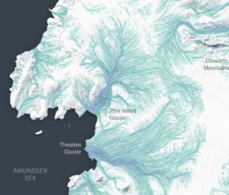
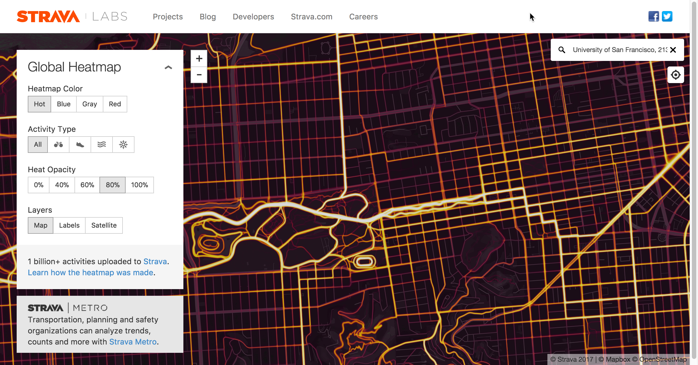
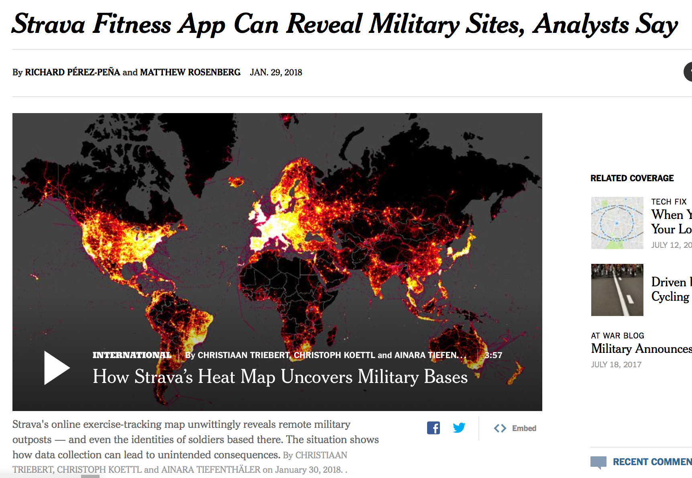
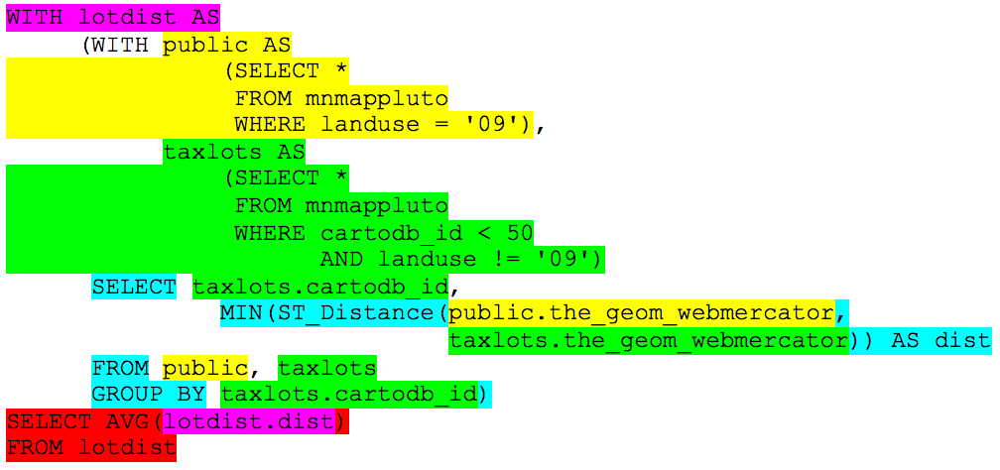
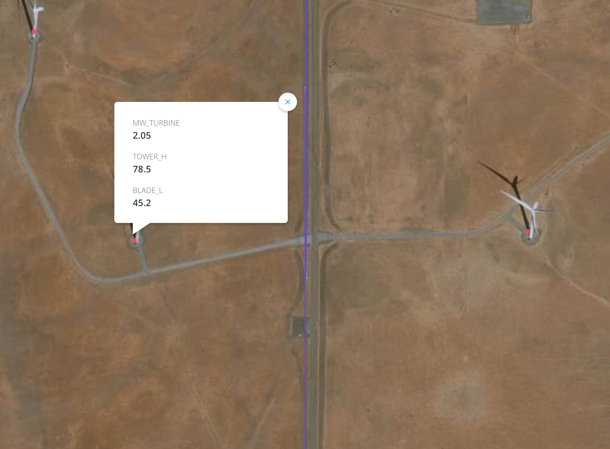
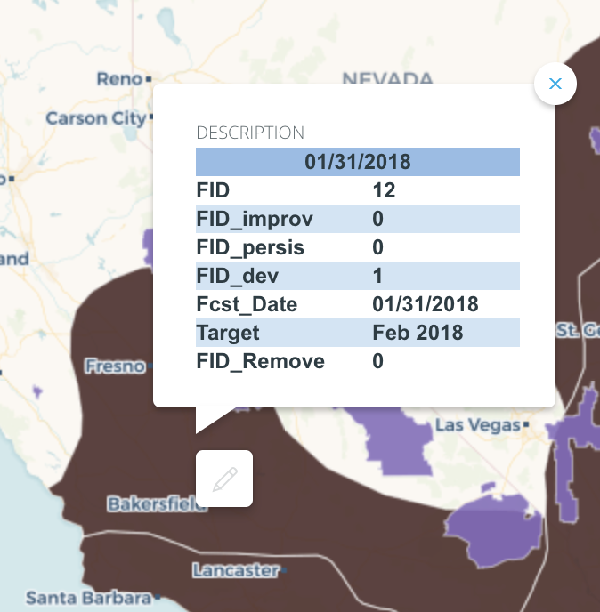

Week 4 - `WITH` statements and dead birds
----

## Homework questions? Final project questions?

## Speakers next week

* Bronwyn Agrios (Co-founder of [AstroDigital](https://astrodigital.com/), former ESRI)
* Kat Scott (Machine Learning lead at [Planet](https://www.planet.com/pulse/author/katscott/))
* Dan Hammer (Co-founder of [Earth Genome](https://www.earthgenome.org/), former NASA)
* Stephanie May ([Apple Maps](https://www.apple.com/ios/maps/))
* Katie Kowalsky ([Mapzen](https://mapzen.com/))

## Map critique (a.k.a. cool maps I like)

[NY Times - Miles of Ice Collapsing into the Sea](https://www.nytimes.com/interactive/2017/05/18/climate/antarctica-ice-melt-climate-change.html) - you should read the entire series - these are amazing maps!   


[Why the Mercator projection sucks](http://bl.ocks.org/vlandham/raw/9216751/)


[Boeing draws a Boeing](https://flowingdata.com/2017/08/04/boeing-draws-a-plane-in-the-sky-with-flight-path/)


[Strava's global heatmap](https://labs.strava.com/heatmap/#14.29/-122.45850/37.77313/hot/all) - [(methodology - now 6x hotter](https://medium.com/strava-engineering/the-global-heatmap-now-6x-hotter-23fc01d301de)


[Strava Fitness App Can Reveal Military Sites, Analysts Say](https://www.nytimes.com/2018/01/29/world/middleeast/strava-heat-map.html)


## Sign up with Medium

Go to [Medium.com](https://www.medium.com). Sign up. Publish one of your old maps. Boom.

## Assignment 3 - bonus question

*Write a query that calculates the average distance between each lot and the closest public space (defined as landuse = '09'). Only calculate this for those tax lots with cartodb_id < 50.*

This is a hard problem. So rather than trying to solve it all at once, let's break it down into pieces.

Get all the public landuse rows:

```sql
SELECT *
FROM mnmappluto
WHERE landuse = '09'
```

Create a new table called `public` based on this query.

Get all the taxlot rows we want to use - with cartodb_id < 50 and non-public landuse:

```sql
SELECT *
FROM mnmappluto
WHERE cartodb_id < 50
  AND landuse != '09'
```

Create a new table called `taxlots` based on this query.

Calculate which public space is closest to each tax lot.

```sql
SELECT taxlots.cartodb_id,
		MIN(ST_Distance(public.the_geom_webmercator,
						taxlots.the_geom_webmercator))
		  AS dist
FROM public, taxlots
GROUP BY taxlots.cartodb_id
```

Try that query without the MIN or GROUP BY. What is different?

```sql
SELECT taxlots.cartodb_id,
		ST_Distance(public.the_geom_webmercator,
					taxlots.the_geom_webmercator) AS dist
FROM public, taxlots
ORDER BY taxlots.cartodb_id, dist ASC
```

Store that in a table called `lotdist`.

Calculate the average distance to a public space for the rows we care about (non-public space with cartodb_id < 50):

```sql
SELECT AVG(lotdist.dist)
FROM lotdist
```

The answer is 177m.

That works, but it's cumbersome because you have all these intermediate tables that you don't actually care about. And you'd have to redo a bunch of work if you decided you wanted to look at all taxlots instead of those `WHERE cartodb_id < 50`, or a different landuse type.

We can do the same thing in a single query using `WITH` statements. `WITH` statements let you create subqueries that you use in a main query. You can define multiple temporary "tables" at a time, and WITH statements can be nested. So we can combine the earlier, simpler statements into something crazy like this:

```sql
WITH lotdist AS
	(WITH public AS 
			(SELECT *
			 FROM mnmappluto
			 WHERE landuse = '09'),
	      taxlots AS
			(SELECT *
			 FROM mnmappluto
			 WHERE cartodb_id < 50
				AND landuse != '09')
	 SELECT taxlots.cartodb_id,
		     MIN(ST_Distance(public.the_geom_webmercator,
		     				 taxlots.the_geom_webmercator)) AS dist
	 FROM public, taxlots
	 GROUP BY taxlots.cartodb_id
SELECT AVG(lotdist.dist)
FROM lotdist
```

This is confusing! I'd never have been able to write that query from scratch. It's important to start with simpler pieces and then assemble the final product you want.

To help you understand how this query is structured, here's a color-coded diagram showing where different subqueries are reused.



## Spinning blades of death




**Upload the following four datasets, and rename them as `bird_routes`, `turbines`, `drought`, and `parks`, respectively.**

1. [Birds - Breeding Survey Routes [ds60]](http://catalog.data.gov/dataset/birds-breeding-survey-routes-ds60) ([direct download](ftp://ftp.dfg.ca.gov/BDB/GIS/BIOS/Public_Datasets/001_099/ds060.zip)). This data set provides access to information gathered on annual breeding bird surveys in California using a map layer developed by the Department. This data layer links to the breeding birds survey information that has been gathered from observers, compiled, and made available over the internet by the Migratory Bird Research Program, Patuxent Wildlife Research Center of the U.S. Geological Survey.  

	The Breeding Bird Survey web site can be reached directly [here](http://www.pwrc.usgs.gov/bbs). A more complete description of the breeding bird survey program is available [here](http://www.mbr-pwrc.usgs.gov/bbs/genintro.html) and [here](http://www.pwrc.usgs.gov/bbs/about).

2. [Onshore Industrial Wind Turbine Locations for the United States to March 2014](https://catalog.data.gov/dataset/onshore-industrial-wind-turbine-locations-for-the-united-states-to-march-2014) ([direct download](https://www.sciencebase.gov/catalog/file/get/55c4aa9be4b033ef52106e2f)). This data set provides industrial-scale onshore wind turbine locations, corresponding facility information, and turbine technical specifications, in the United States to March 2014. The database has nearly 49,000 wind turbine records that have been collected, digitized, locationally verified, and internally quality assured and quality controlled. Turbines from the Federal Aviation Administration Digital Obstacle File, product date March 2, 2014, were used as the primary source of turbine data points.
3. [Climate Prediction Center (CPC) Monthly Drought Outlook (MDO)](http://catalog.data.gov/dataset/climate-prediction-center-cpc-monthly-drought-outlook-mdo) ([direct download for 2018-01-31 update](ftp://ftp.cpc.ncep.noaa.gov/GIS/droughtlook/mdo_polygons_20180131.zip)). The map shows where current drought areas are expected to improve, be removed, or persist with intensity, as well as new areas where drought may develop, at the end of the forecast period.
4. Connect the National Parks boundaries from the Carto Data Library.  This table includes Parks, Monuments, Seashores, and Recreation Areas.

##### Be sure to rename the tables in Carto to `bird_routes`, `turbines`, `drought`, and `parks`, respectively. Because the national parks table is from the data library and cannot be modified, you'll need to duplicate it and rename the duplicate.

Add all four data sets to a map to get a feel for the data.

Answer the following questions:

- How many wind turbines are within 2 miles of USGS bird routes in California?  Display these turbines on a map with **only** the affected bird routes.  Style the map so that you can adequately see the point of this.  Also, for kicks, turn on the satellite image basemap to see the actual turbines from space.

```sql
WITH nearby AS
	(SELECT turbines.*
	 FROM turbines, bird_routes
	 WHERE ST_DWithin(turbines.the_geom_webmercator,
			          bird_routes.the_geom_webmercator,
					  2*1609))
SELECT COUNT(nearby.*) FROM nearby
```

**Note**: To display the turbines within two miles of bird routes **and** the bird routes within two miles of turbines, you will have to apply the `ST_DWithin` query within the SQL editor for both layers on the same map. The two queries require only minor modifications to the query above.

Let's see what that two mile buffer actually looks like. PostGIS has an `ST_Buffer` operation that will help. Let's give it a try.

```sql
SELECT bird_routes.cartodb_id,
    ST_Buffer(bird_routes.the_geom_webmercator,
    		    2*1609) AS the_geom_webmercator
FROM bird_routes
```

Create a new data set from that query, then make a map of it along with the original bird routes layer.

Let's get a bit more complicated and only buffer the routes that are close to turbines. Create a web map of these buffers that includes just the `cartodb_id` and the geometry fields.

```sql
WITH nearby AS
	(SELECT bird_routes.*
	 FROM turbines, bird_routes
	 WHERE ST_DWithin(turbines.the_geom_webmercator,
			          bird_routes.the_geom_webmercator,
					  2*1609))
SELECT nearby.cartodb_id,
    ST_Buffer(
      nearby.the_geom_webmercator,
      2*1609
    )) AS the_geom_webmercator
FROM nearby
GROUP BY nearby.cartodb_id
```

- Suppose I want to go to a US National Park (not a National Preserve or National Monument) for bird watching as as surveyor.  Which National Parks are along survey routes in California? Highlight them on a map.

```sql
SELECT
    parks.*
FROM
    parks,
    bird_routes
WHERE
    ST_Intersects(
        parks.the_geom_webmercator,
        bird_routes.the_geom_webmercator
    )
```

- Suppose that I now only want to visit national parks with bird routes *with developing drought*.  You know, the ones where bird habitats are probably starting to decline. I want to get there before they're gone. This is a little annoying given the data in the `drought` table, but it's doable.

Get polygons for developing drought. Let's call this `dev_drought`. The query is a little weird since they've put HTML code inside the table. But trust me, the `FID_dev` stuff is the table row that encodes the information about a developing drought.



```sql
SELECT * FROM drought
	 WHERE description ILIKE 
'%FID_dev</td>

<td>1%'
```

Let's call that `dev_drought`.

Get parks that have bird survey routes. Let's call this `bird_parks`.

```sql
SELECT parks.*
	 FROM parks, bird_routes
	 WHERE ST_Intersects(
        parks.the_geom,
        bird_routes.the_geom)
```

Then we can intersect the two and figure out which parks to go to.

```sql
SELECT DISTINCT(bird_parks.unit_name)
FROM bird_parks, persisting
WHERE ST_Intersects(
	bird_parks.the_geom,
	dev_drought.the_geom)
ORDER BY bird_parks.unit_name ASC
```

Put it all together using a `WITH` statement.

```sql
WITH dev_drought AS
	(SELECT * FROM drought
	 WHERE description ILIKE 
'%FID_dev</td>

<td>1%'),
	 bird_parks AS
	(SELECT parks.*
	 FROM parks, bird_routes
	 WHERE ST_Intersects(
        parks.the_geom,
        bird_routes.the_geom))
SELECT DISTINCT(bird_parks.unit_name)
FROM bird_parks, dev_drought
WHERE ST_Intersects(
	bird_parks.the_geom,
	dev_drought.the_geom)
ORDER BY bird_parks.unit_name ASC
```


## Assignment 4

This is the **last** assignment before the final project is due on March 5! We have speakers coming next week, but if you have questions about your projects bring them to class. I'll help you with any issues you may have, once the speakers are done.

**Reminder: I will be offline the week of Feb. 26-March 4. I will not be able to help you with final projects during that time. I strongly recommend that you finish your map(s) before then, and work on your blogpost while I'm offline.**

#### Part 1

**Question 1**  
Download [active fires](https://earthdata.nasa.gov/earth-observation-data/near-real-time/firms/active-fire-data) for the "USA (Conterminous) and Hawaii" in the past 7 days as detected by NASA's VIIRS 375m sensor.

* **Post a *single* SQL query to find the ten county-days with the most fires detected in the past seven days.**

To be clear, a county on one day should be treated differently than a county on another day.  You are looking for the ten county-days with the most fires. A county may be listed twice if it contained a lot of fires on two days. A day may be listed twice if two counties had a lot of fires on the same day.

**HINT:** To make this work, you'll need to use `ST_Intersects` and `GROUP BY`, among other things we've seen in class.

**BONUS:** Which states are those 10 counties in? Post the answer and your query.

**Question 2**  
Create an animated map of the fires that loops every 7 seconds, one second for each day represented in the fires data set.  Spend some time making this look good.  Post the CartoCSS along with the web map URL.

#### Part 2

1. Create the map or maps you'll need for your final project These will be drafts, so they don't have to be perfect or final.
2. Write an outline for the blogpost.

Post the map URL(s) and outline to Canvas.